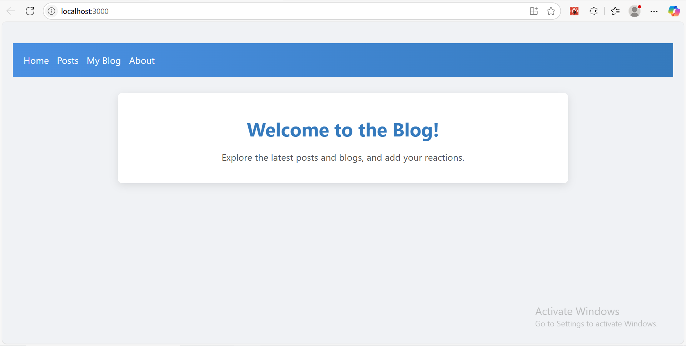
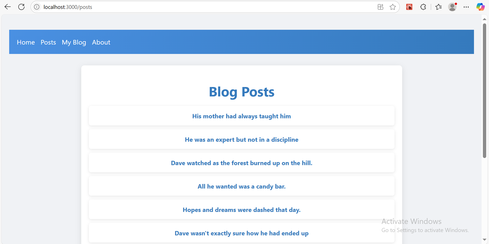
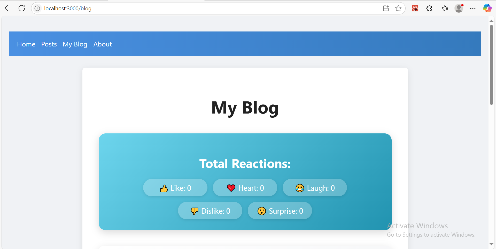
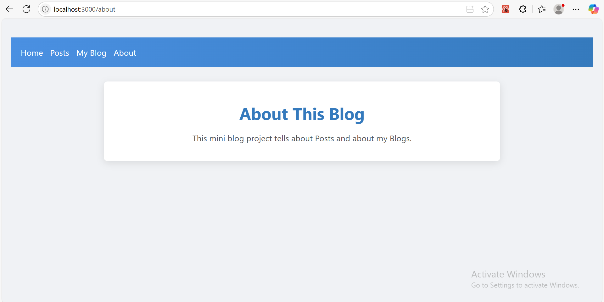
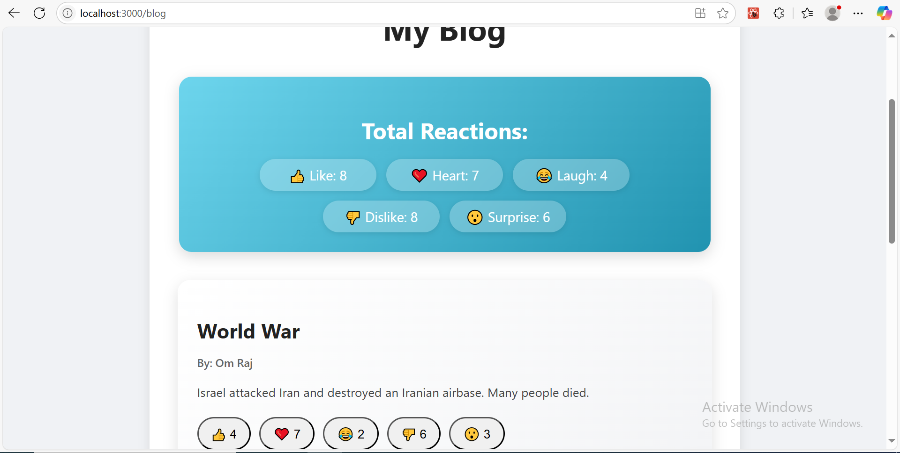
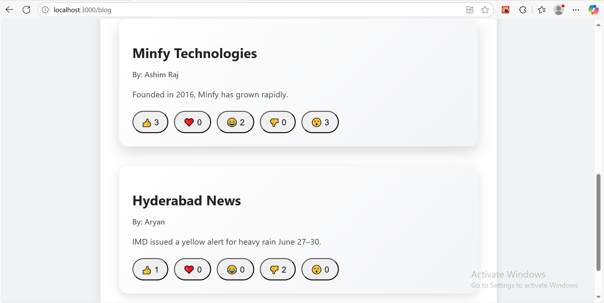
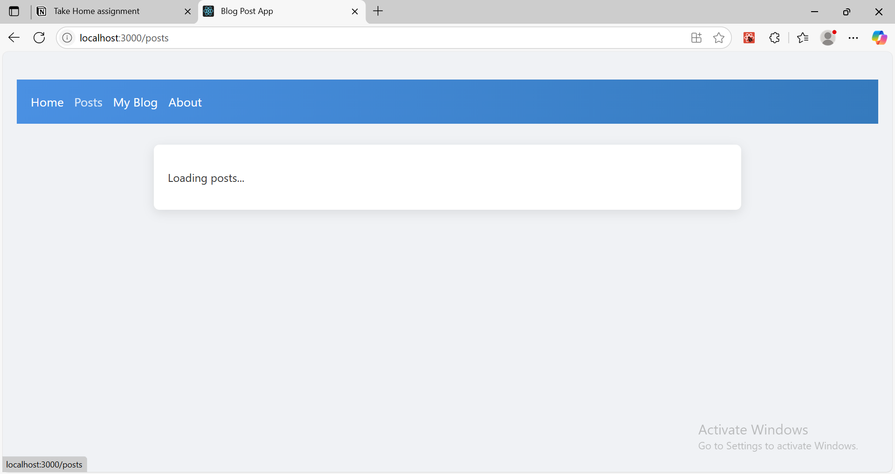
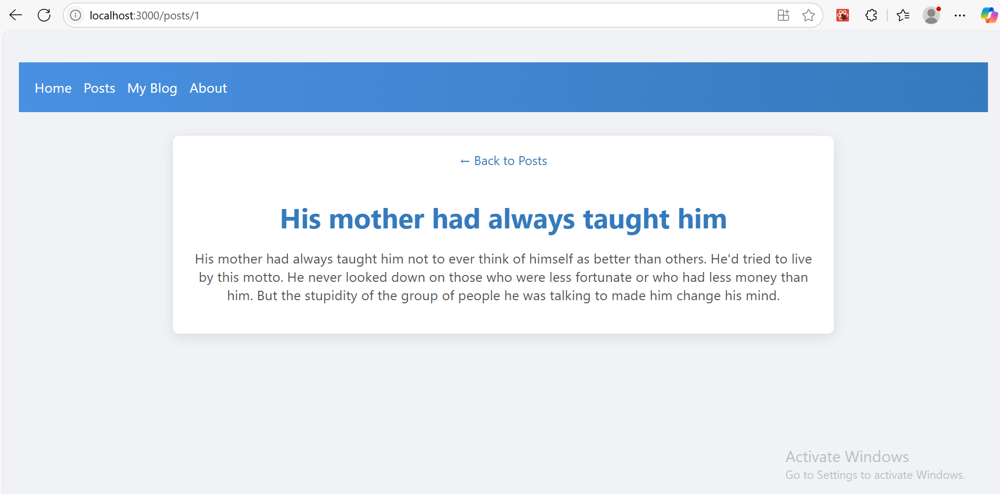
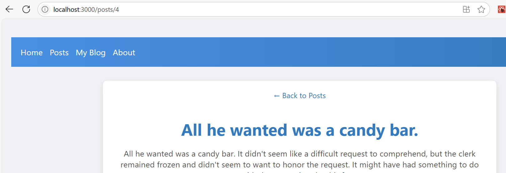
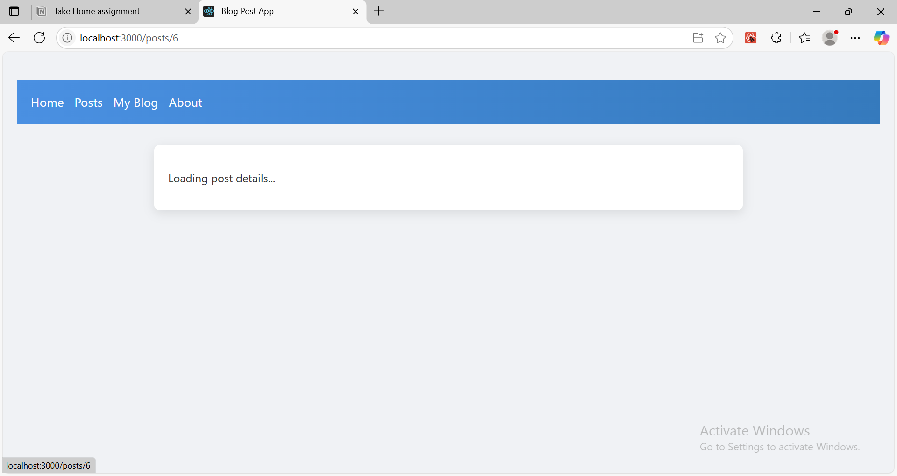

# Blog Post with Reactions - Mini Project

## Added interactive Reaction Buttons for each blog post:
- 👍 Like
- ❤️ Heart
- 😂 Laugh
- 👎 Dislike
- 😮 Surprise

Each reaction can be clicked, and its count increases, both at the blog post level and at the total summary level.

---

## Maintained a Total Reaction Summary at the top of the page to show:
- Total number of Likes
- Total number of Hearts
- Total number of Laughs
- Total number of Dislikes
- Total number of Surprises

This summary updates live as users react to different blog posts.

---

## WebPage:

---

## Live Blog like count:

---

## Loading posts page:

---

## Blog posts page:

---

## Back to Posts Page:

---

## Loading post details page:
