# Recipe Finder

## Part 1: Easy Features:

### Outputs

- Main Page
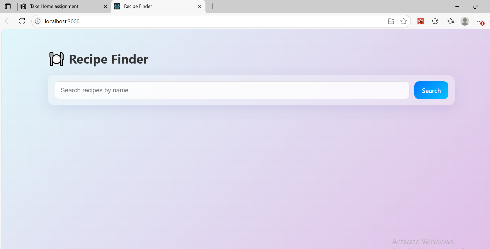

- User searches for a item
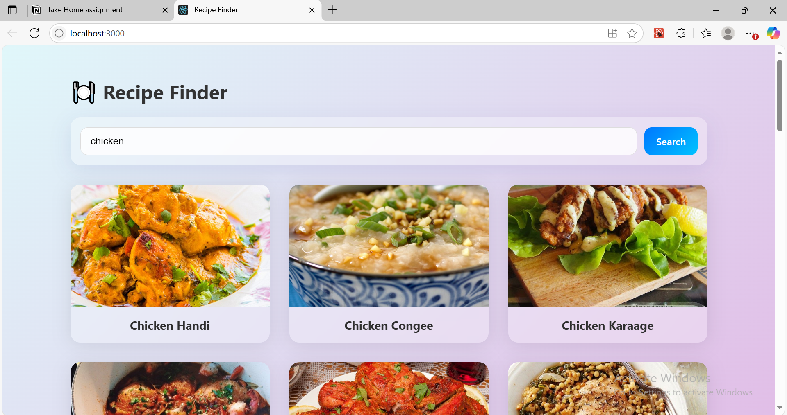

- Showing a "Searching for recipes..."
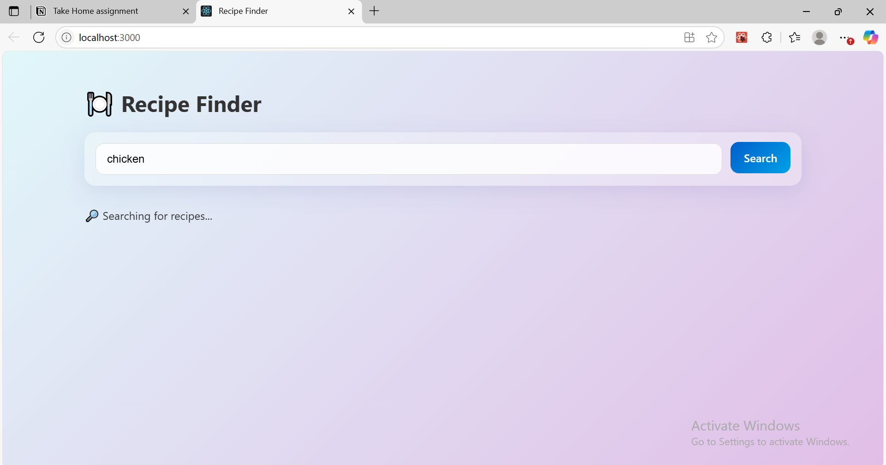

- "no results found" case
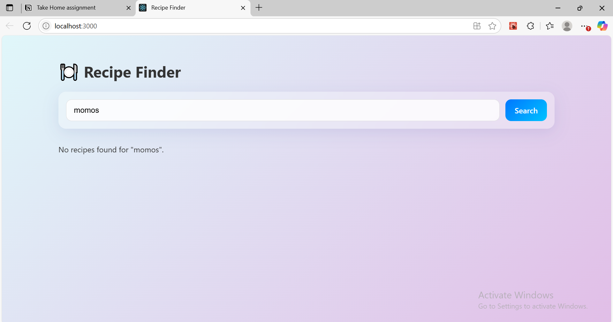

- The application is styled and look presentable. Used my preferred styling method. The layout is clean and responsive enough to be usable on a mobile-sized screen.

---

## Part 2: Medium Features:

### Outputs

- Integrated react-router-dom into my application.

- Should be navigated to a dedicated detail page, for example: /recipe/52772
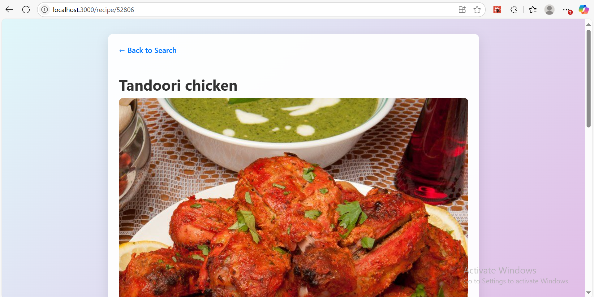

- Created a new component for Recipe Detail Page.

- Display all the important details
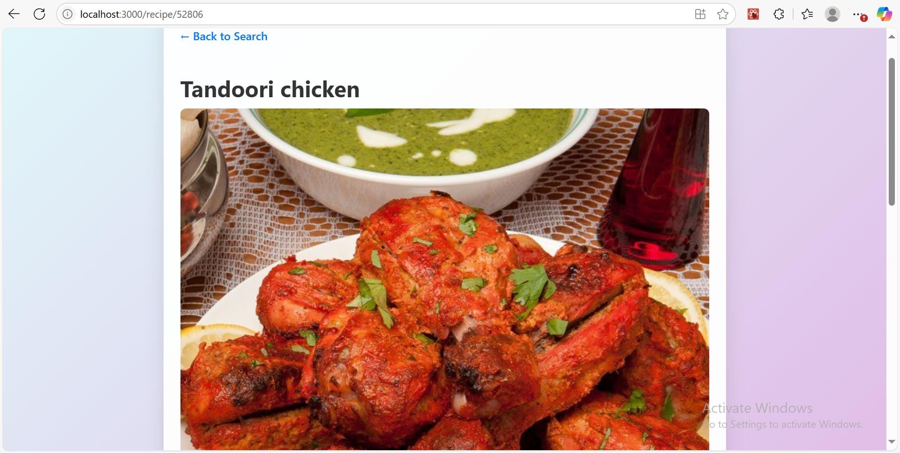
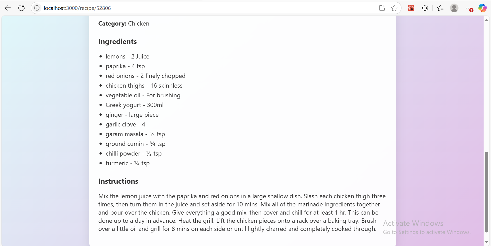

- "Back to Search" Link
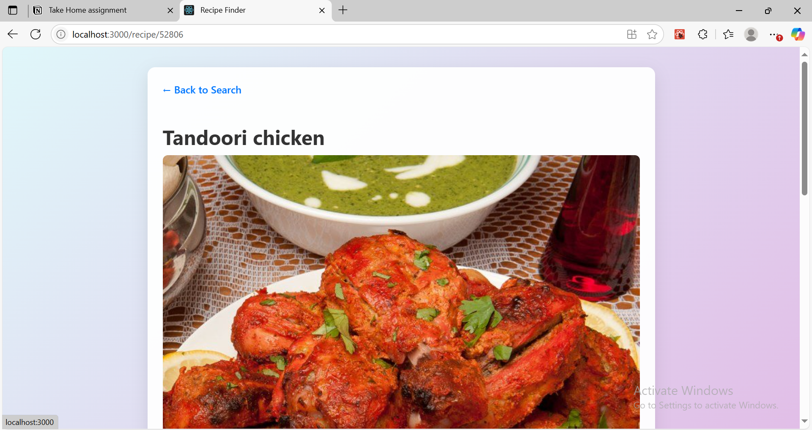
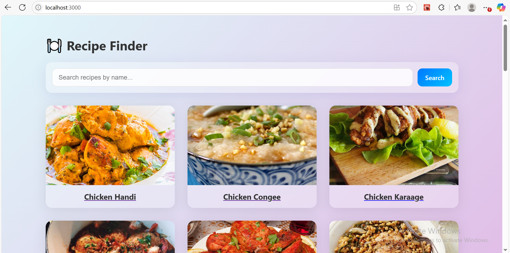

---

## Part 3: Hard Features:

### Outputs

- Final Website Frontend
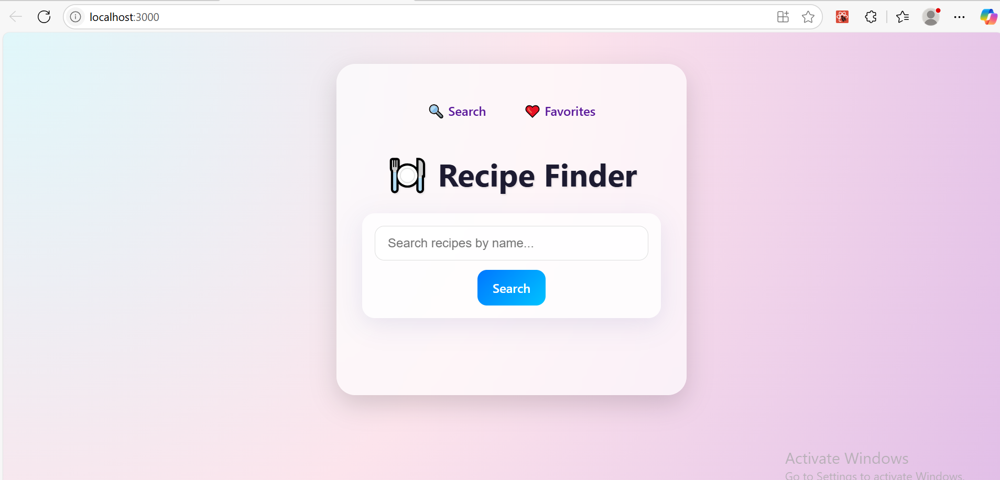

- On each recipe detail page, add a "❤️ Add to Favorites" button
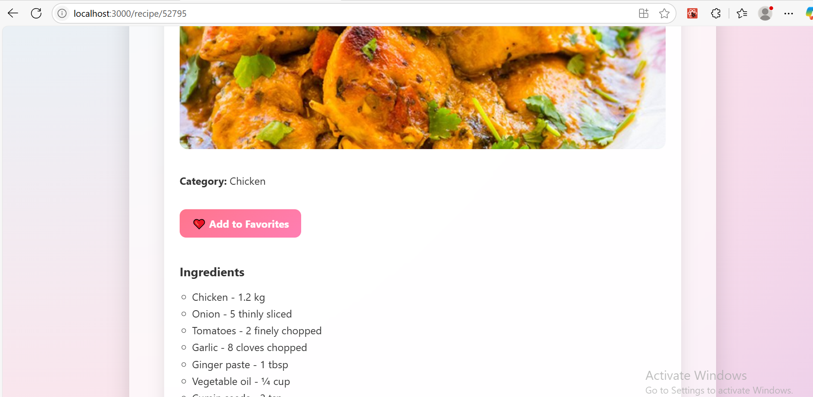

- Create a separate page at a new route that displays a list of all the user's saved recipes
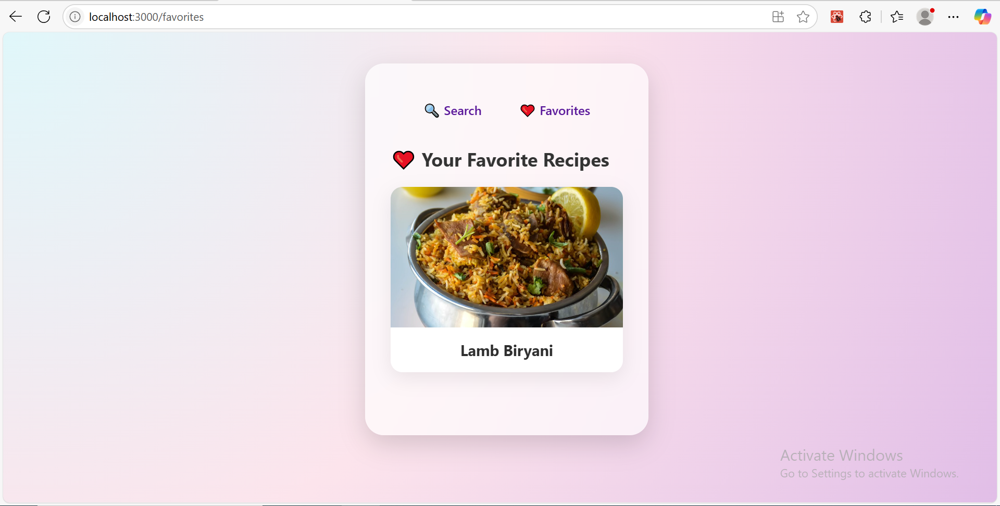

- If a recipe is already in favorites, the button should change to "💔 Remove from Favorites"
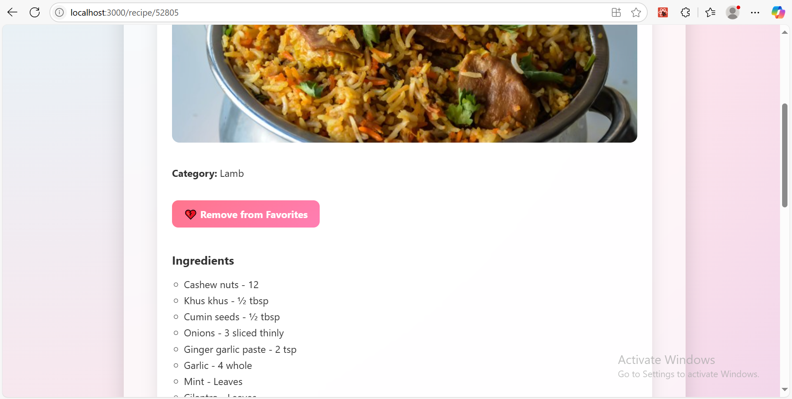

---

## Advanced Features

### Global State with Context & Reducer
- Implemented a centralized global state using React.createContext + useReducer.
- This allows the detail page and favorites page to both interact with the favorites list.
- Avoids the need to pass props deeply across components.

### Data Persistence with localStorage
- On load, the app checks localStorage and preloads the user's favorite recipes.
- Any changes to the favorites list are automatically written back to localStorage.
- This makes the experience seamless and persistent across sessions.