# A Robust Auth App with Profile Management

## Link to the deployed application:

https://robust-auth-app.web.app/

---

## Build on the "Easy" version's foundation:
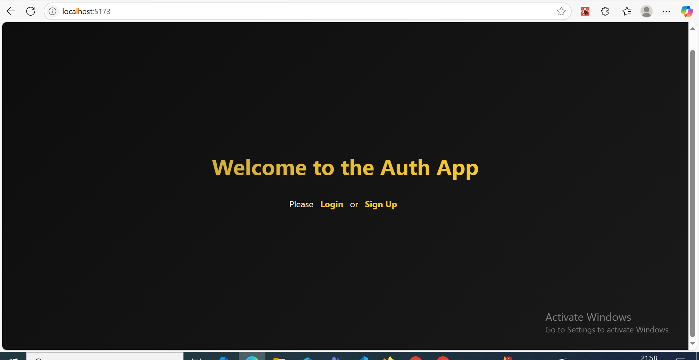

---

## Global State Management:

### Logout Page:
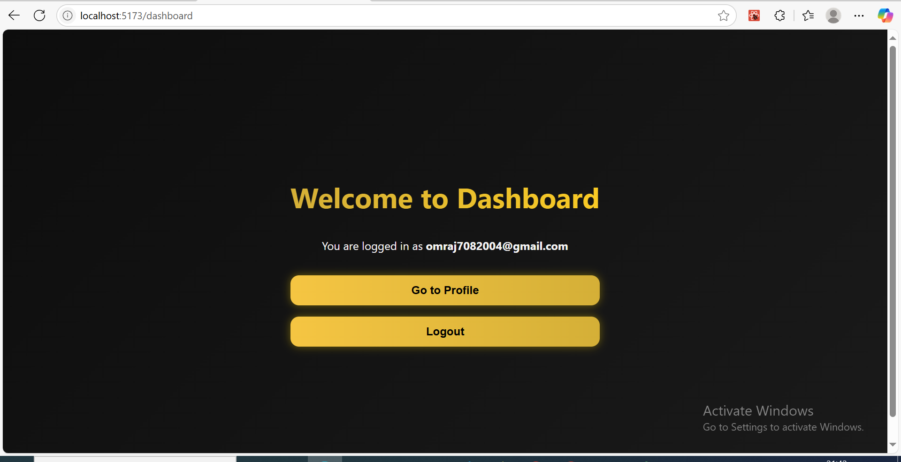

---

## Enhance Authentication Features:

### Forgot Password?" feature:
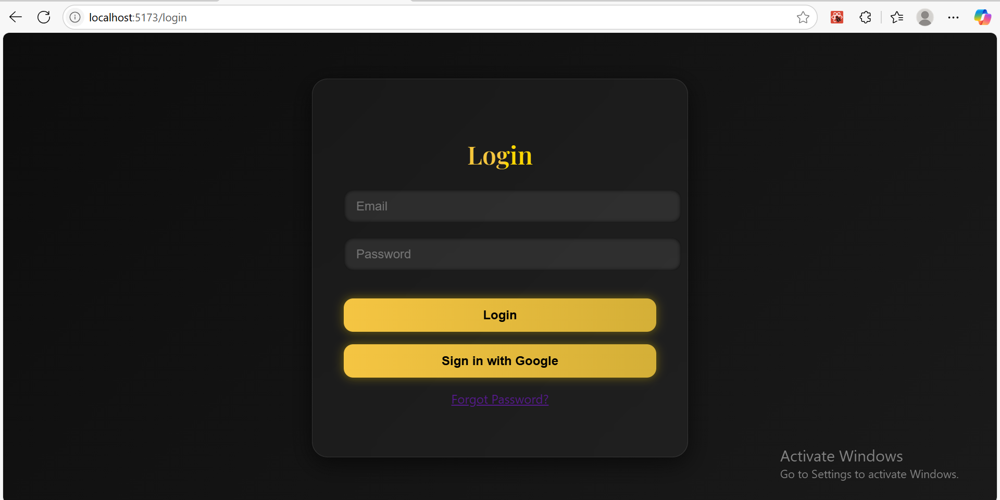
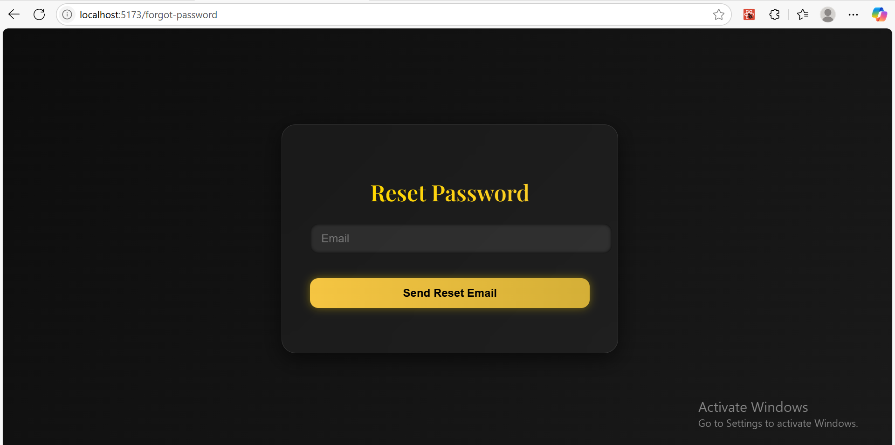
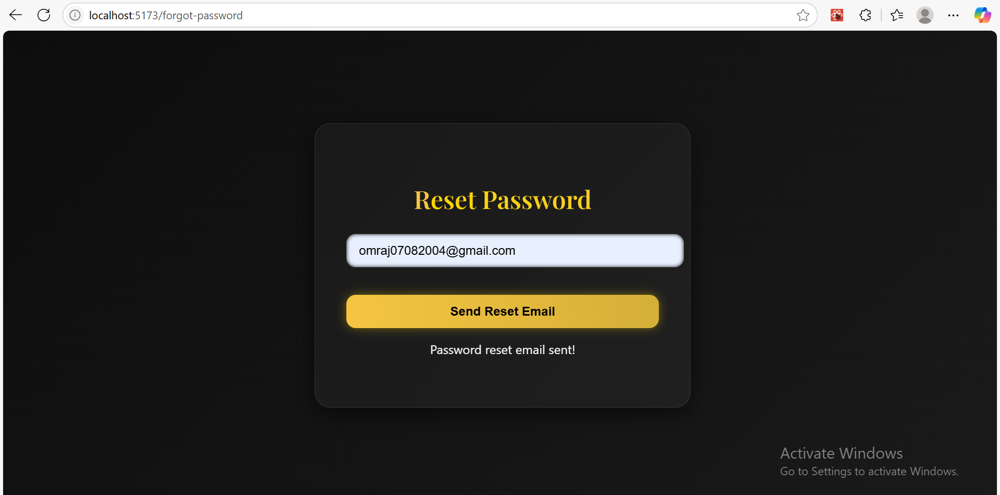
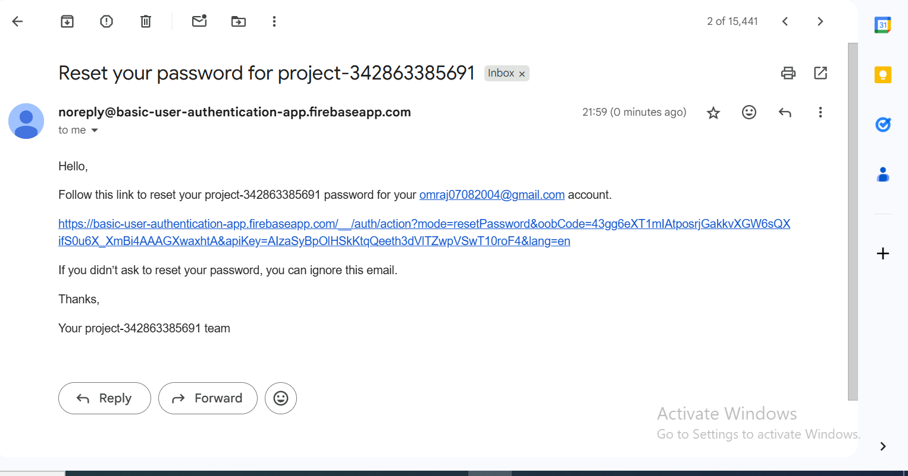
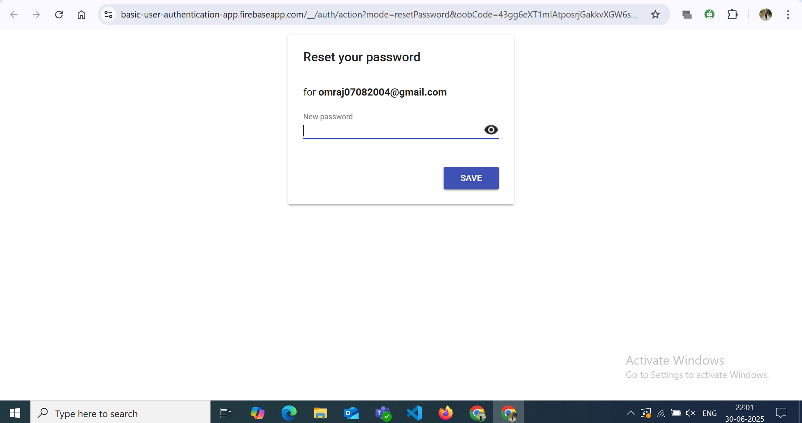
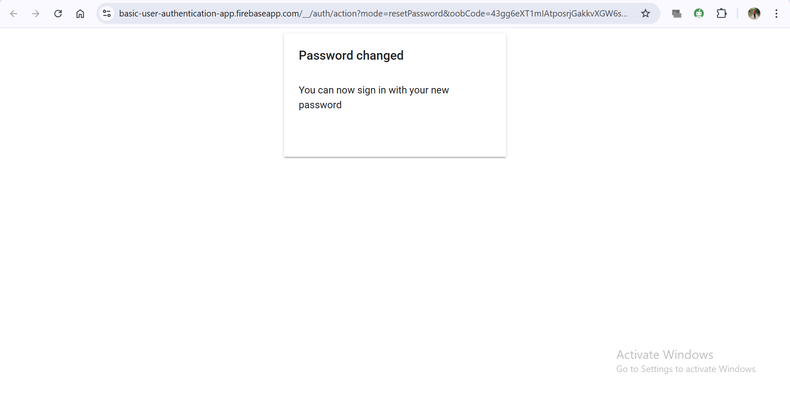

### Add a "Sign in with Google" button


---

## Improve User Experience:

### This email is already in use:
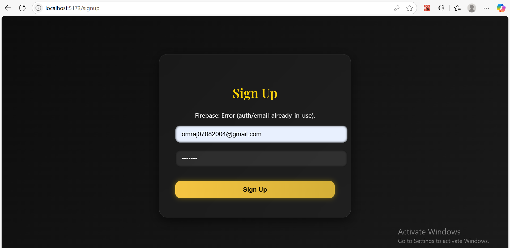

### Invalid password:
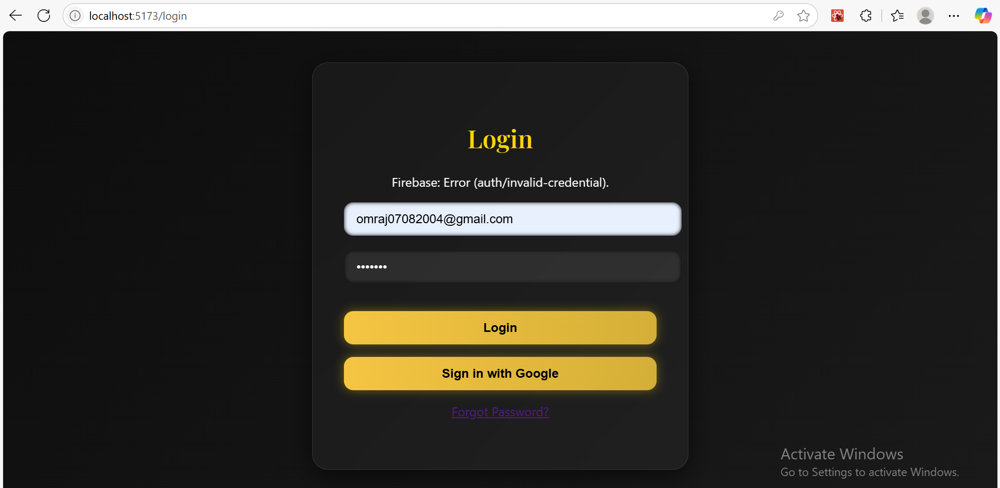

---

## Profile Page:

### display the currently logged-in user's email and UID:
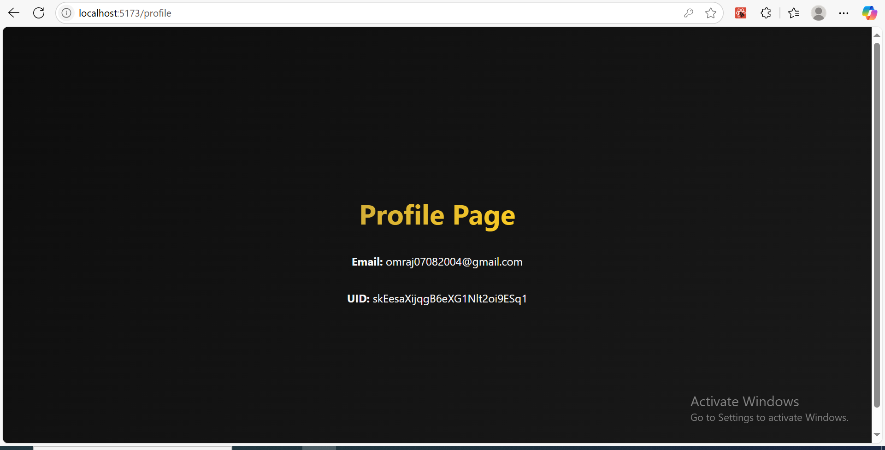

---

## (Bonus Task):

### Add email verification:
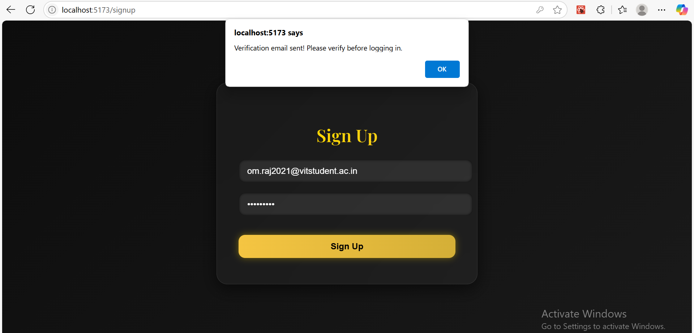
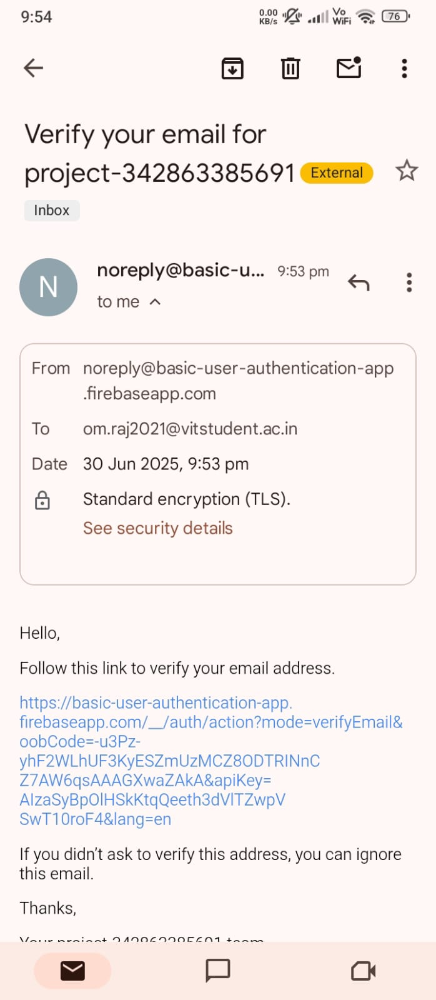
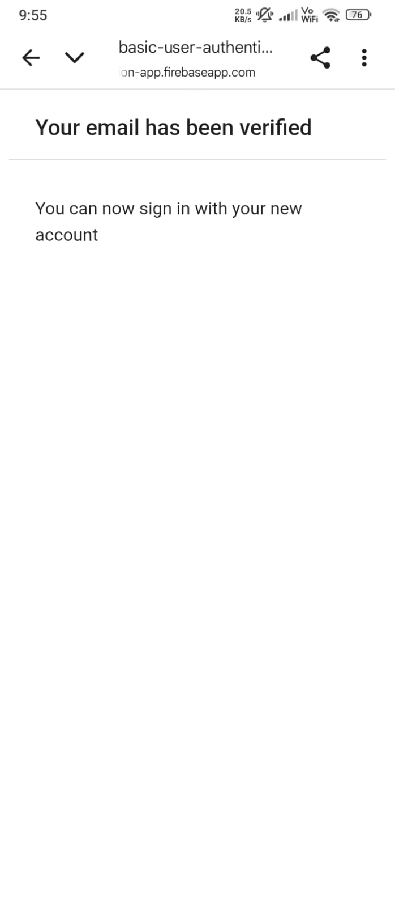
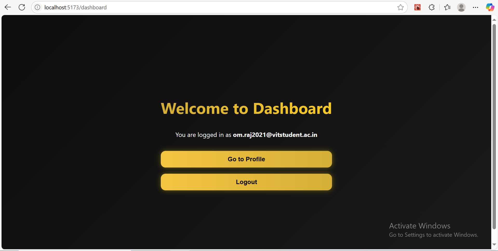

---

## Local setup instructions:

- Clone the repo & install dependencies
```bash
git clone my repo
cd user-auth-app
npm install
```

- Create a Firebase project & enable Email/Password login.

- Create a .env file in the root with your Firebase config:
```
VITE_FIREBASE_API_KEY=...
VITE_FIREBASE_AUTH_DOMAIN=...
VITE_FIREBASE_PROJECT_ID=...
VITE_FIREBASE_STORAGE_BUCKET=...
VITE_FIREBASE_MESSAGING_SENDER_ID=...
VITE_FIREBASE_APP_ID=...
```

- Run the app:
```bash
npm run dev
```

- Visit: http://localhost:5173

---

## A short description of the advanced features you implemented (Context, Google Sign-in, Password Reset):

- **Auth Context**: Centralized authentication state management using React Context to avoid prop drilling.
- **Google Sign-In**: Integrated Google authentication via Firebase's popup method for quick and secure login.
- **Password Reset**: Added a "Forgot Password?" feature that emails users a secure password reset link.