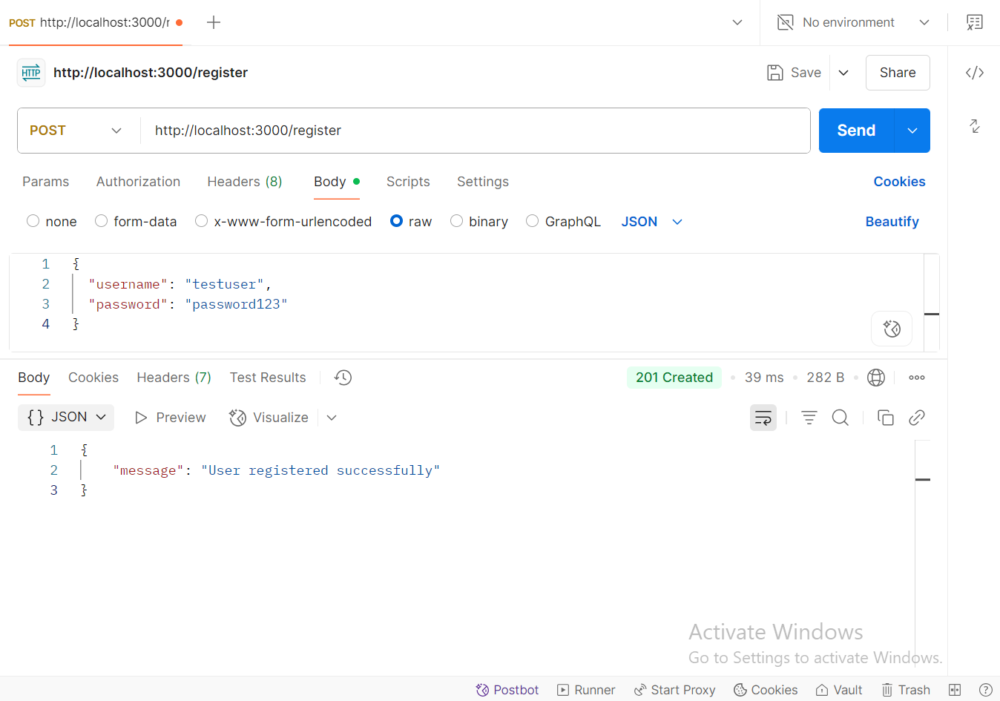
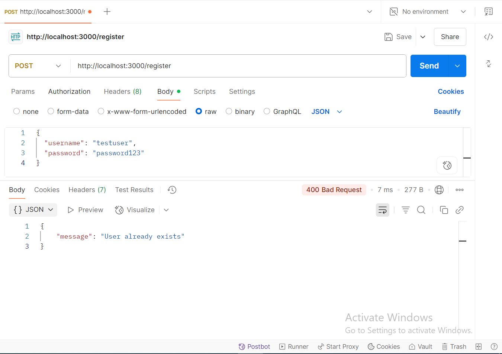
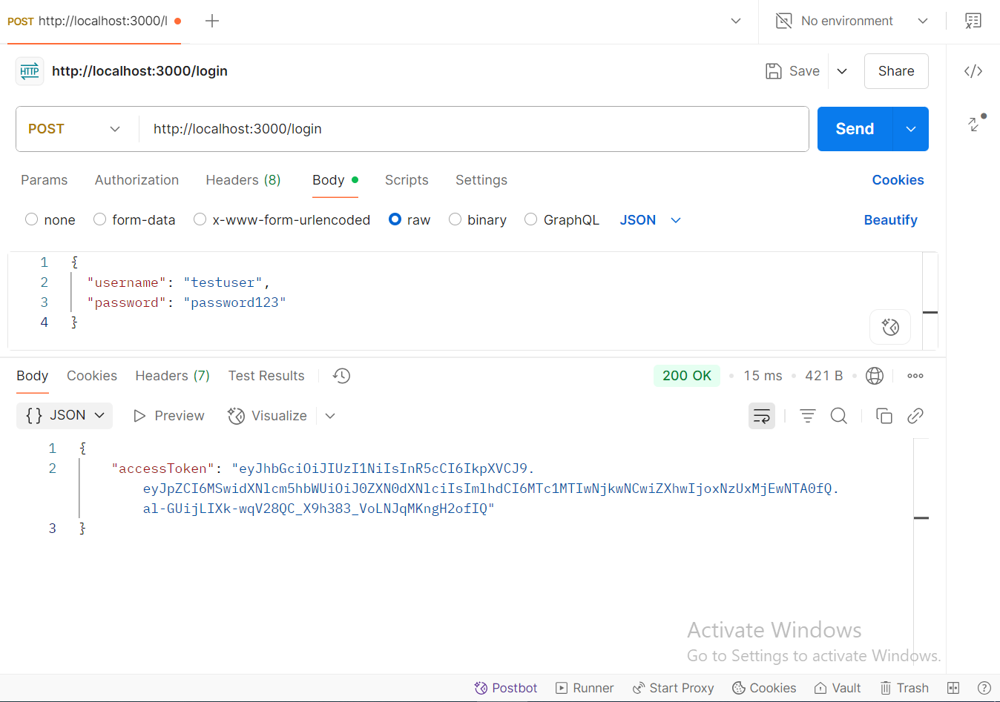
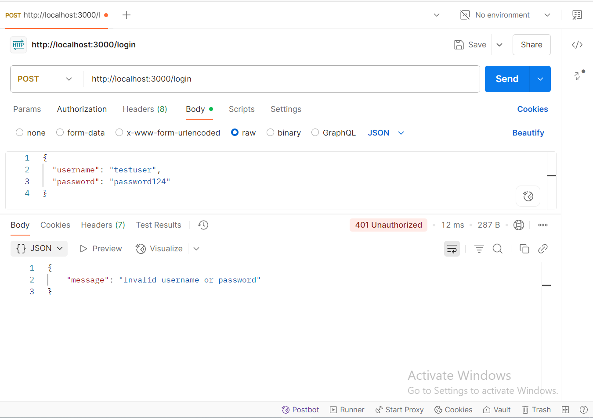
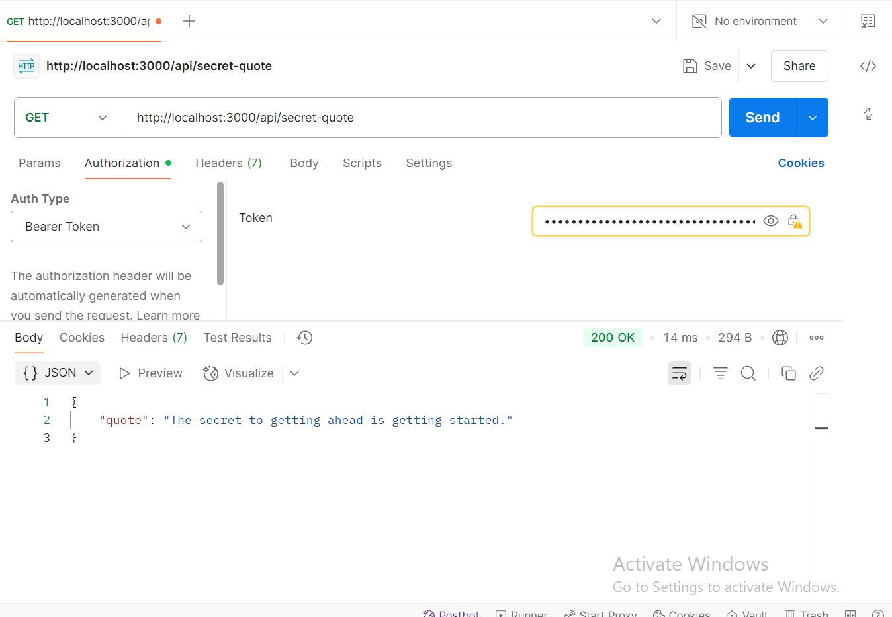
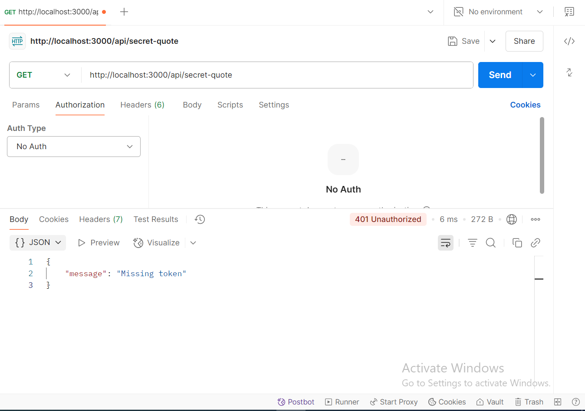
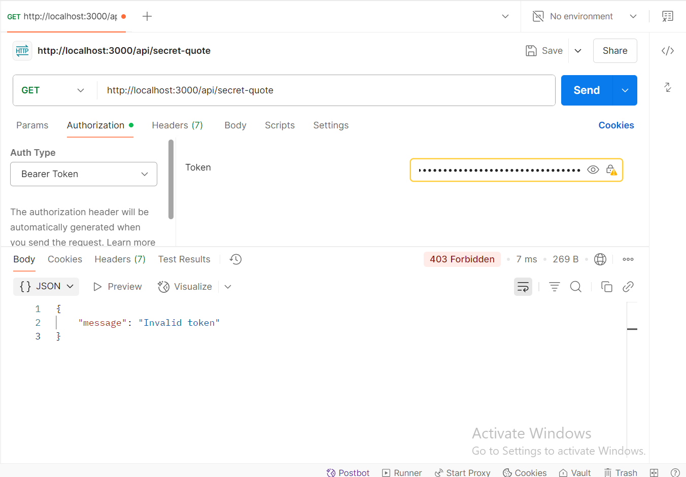

# Secret Quote API

A simple Node.js + Express API that demonstrates JWT-based authentication.

## Features:

- Register and login users (in-memory).
- Generate JWT tokens.
- Protect routes with JWT middleware.
- Access secret content with a valid token.

---

## Setup:

```bash
git clone my repo
cd secret-quote-api
npm install
npm start
```

---

## Create Endpoints:

### POST /register




### POST /login




---

## Create a Protected Route:

### Access Protected Route



---

## Create Authentication Middleware:

### Missing Token



### Invalid Token



---

## Testing with Postman:

- Register a user
- Login and copy the token from the response
- Use the token as Authorization: Bearer token in headers to access /api/secret-quote