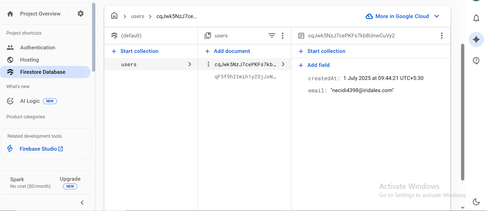

# A Simple User Profile Page

## Link to the deployed application:

https://simple-user-profile-page.web.app

---

## Start with your completed "Easy" or "Medium" Firebase Authentication project (Assignment 2):


---

## Firestore Setup:

- Enabled Cloud Firestore.
- Started in Test Mode for this assignment (which allows all reads/writes).

---

## Data Modeling:

### When a user successfully signs up, in addition to creating the auth user, create a new document for them in a   users collection in Firestore:


### The Document ID for this new document must be the user's UID from the authentication result (user.uid):


### The document should store their email and a createdAt timestamp:


---

## Create a Profile Page:

### Display the user's email and the date they signed up on the page:


---

## A screenshot of your Firestore users collection in the Firebase console:


---

## Local setup instructions:

- Clone the repo & install dependencies
```bash
git clone my repo
cd user-auth-app
npm install
```

- Create a Firebase project & enable Cloud Firestore.

- Create a .env file in the root with your Firebase config:
```
VITE_FIREBASE_API_KEY=...
VITE_FIREBASE_AUTH_DOMAIN=...
VITE_FIREBASE_PROJECT_ID=...
VITE_FIREBASE_STORAGE_BUCKET=...
VITE_FIREBASE_MESSAGING_SENDER_ID=...
VITE_FIREBASE_APP_ID=...
```

- Run the app:
```bash
npm run dev
```

- Visit: http://localhost:5173