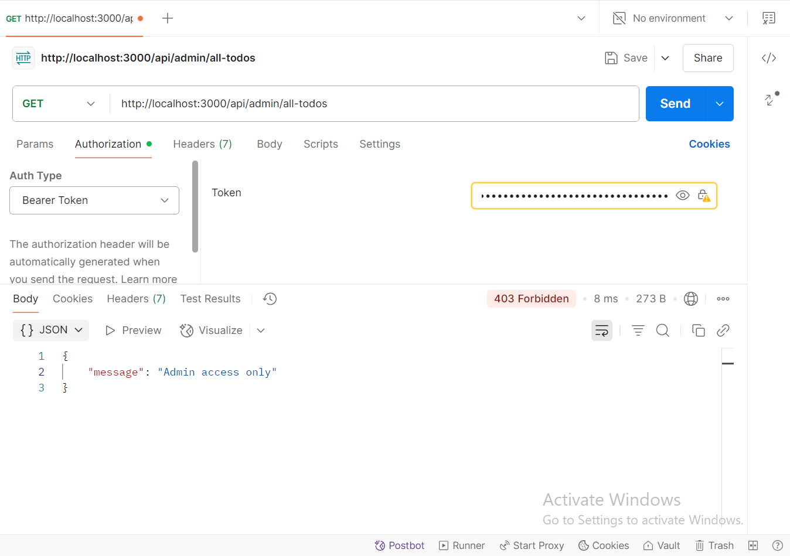

# To-Do List API

This is a secure Express.js API that lets users register, login, and manage their own to-do items using JWT and bcrypt.

## Features

- Secure password storage with bcrypt
- JWT-based authentication
- Protected CRUD for to-dos (user-specific)
- Admin role support with special routes

---

## Setup

```bash
git clone my repo
cd todo-api
npm install
npm start
```

---

## Enhance Security:

### Register Users (with bcrypt)


### Register Admin (with bcrypt)


### Login & Get JWT Token


---

## User-Specific Data:

### Create a To-Do


---

## Implement Full CRUD for To-Dos:

### Get Your To-Dos


### Delete Your Own To-Do


---

## (Bonus Task) Role-Based Authorization:

### Admin: Get All To-Dos




---

## How to Test All Endpoints:

- Use a tool Postman

---

## A clear explanation of how you ensured a user can only access their own data:

Each user can only access their own data through the following mechanisms:

- When a user logs in, they receive a JWT token that includes their id and role.
- All protected routes use an authenticateToken middleware that extracts this id from the token (req.user.id).
- To-do routes (like GET /api/todos and DELETE /api/todos/:id) use this id to:
  - Return only the to-dos that match the current user's userId.
  - Ensure a user can only delete their own to-dos.
- This guarantees that no user can access or modify another user's data.

---

## If you completed the bonus task, explain how to test the admin functionality:

- Register a user with "role": "admin" during /register.
- Log in as that admin and get the accessToken.
- Make a GET request to /api/admin/all-todos with the token in the Authorization header.
- If the user is an admin, all to-dos from all users will be returned.
- If the user is not an admin, the API will respond with:  
  { "message": "Admin access only" }