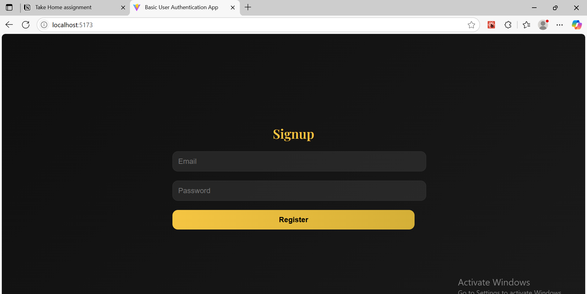
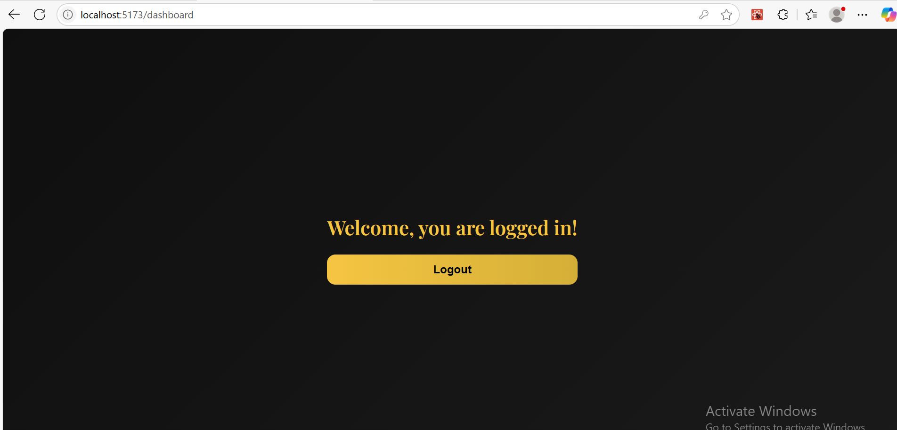
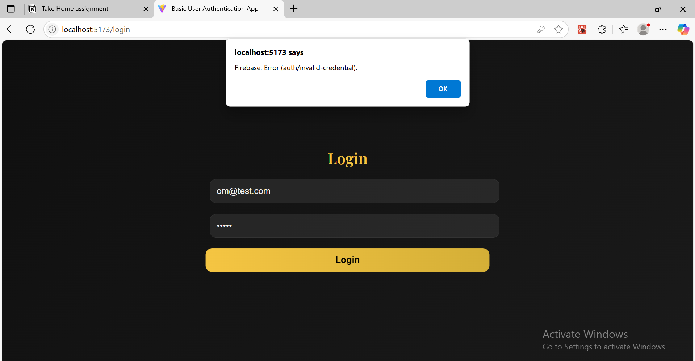
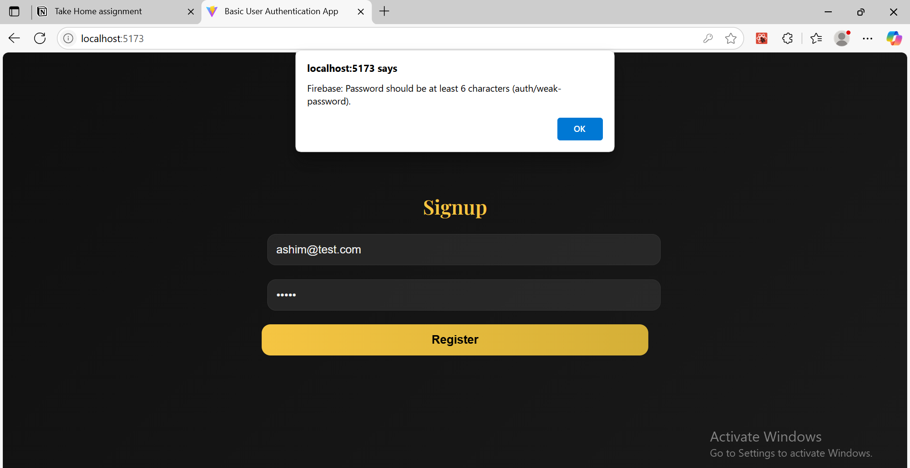

# A Basic User Authentication App

## Link to the deployed application:

https://basic-user-authentication-app.web.app/

---

## Firebase Setup:

- Created a new Firebase project.
- Enabled Email/Password authentication.
- Registered my web app and got my firebaseConfig keys.

---

## React Project Setup:

- Created a new React project using Vite.
- Installed firebase and react-router-dom.
- Set up my Firebase config keys in a .env file and created a src/firebase.js file to initialize the app.

---

## Create Pages/Components:

### Signup Page:


### Login Page:


### Dashboard Page:


---

## Routing and State Management:

### Invalid Passowrd:


### Password Length:


---

## Instructions on how a TA can set up the project locally:

- Clone the repo & install dependencies
```bash
git clone my repo
cd user-auth-app
npm install
```

- Create a Firebase project & enable Email/Password login.

- Create a .env file in the root with your Firebase config:
```
VITE_FIREBASE_API_KEY=...
VITE_FIREBASE_AUTH_DOMAIN=...
VITE_FIREBASE_PROJECT_ID=...
VITE_FIREBASE_STORAGE_BUCKET=...
VITE_FIREBASE_MESSAGING_SENDER_ID=...
VITE_FIREBASE_APP_ID=...
```

- Run the app:
```bash
npm run dev
```

- Visit: http://localhost:5173